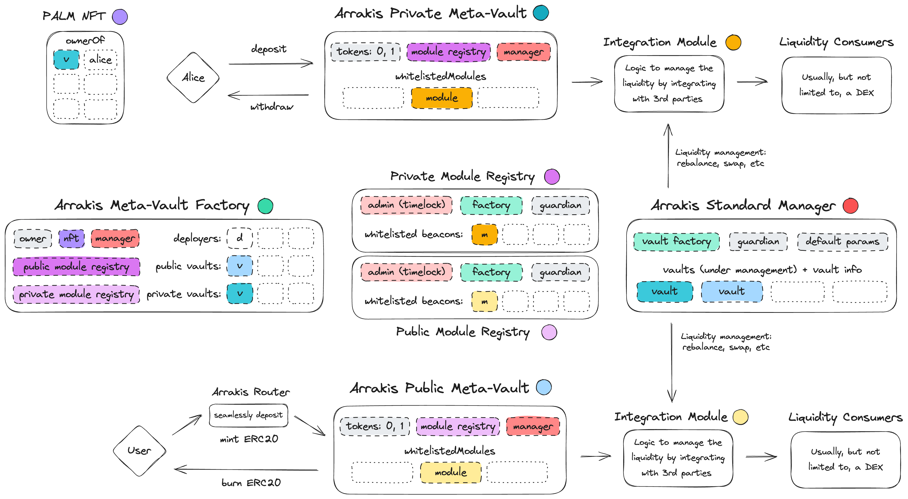

# Arrakis Modular

## Getting Started

In order to run the test suite of Arrakis modular, follow these steps:

1. Clone the repository by running:
```
# if using an SSH key
git clone git@github.com:ArrakisFinance/arrakis-modular.git
```
```
# otherwise
git clone https://github.com/ArrakisFinance/arrakis-modular.git
```
2. As the Valantis librari is private, you'll have to manually paste `valantis-hot` inside `lib/`.
3. Install the required submodules and compile the contracts by running:
```
forge build
```
5. Create `.env` file using `.envExample` as a reference.
6. Execute the test suite by running:
```
forge test -vv
```

## Motivation: 

Arrakis Modular represents the next evolution of Arrakis Finance's liquidity management, aiming to overcome the limitations of previous versions (V1 and V2). Traditionally, our LP vaults allowed Liquidity Providers (LPs) to actively manage or delegate the management of their (DEX) liquidity positions. LPs could invest in shared liquidity provision strategies by holding an ERC20 token representing a share of the underlying strategy. However, Arrakis V1 and V2 were specifically built around Uniswap V3. Therefore, the previous standards were incompatible with other DEXs, and in order to support alternative venues —like Uniswap V4, Balancer, Ambient, etc.— Arrakis would have to make a completely new standard for every integration.

To address this, Arrakis Modular introduces a universal Meta-Vault standard. This modular framework enables the attachment of standardized modules to any two-sided liquidity provision protocol, simplifying the integration process. Key features include:
- **Flexibility**: Modules adhering to a common interface can be easily developed and attached, supporting a broad range of DEXs.
- **Reusability**: The Arrakis Vault standard facilitates the reuse of components and maintenance of standard interfaces, streamlining future expansions.
- **Scalability**: Adapting to new liquidity pool types becomes straightforward, focusing on module development rather than protocol overhauls.

We envision Arrakis Modular not only as a technical advancement but as a platform for community and developer collaboration, inviting contributions to the ecosystem. With this modular approach, Arrakis Finance is poised to rapidly adapt to the evolving DeFi landscape, unlocking new possibilities for liquidity management.
 
Finally, note that the potential for modules extends beyond single DEX integrations. While current use cases focus on individual DEX liquidity provision protocols, in theory, modules could become more complex, enabling integrations with multiple DEXs simultaneously or combining DEX and peripheral protocols like lending markets or options protocols (hedging and delta-neutral strategies could become a reality one day). Although these advanced functionalities are out of scope for now, the architecture of Arrakis Modular supports such future innovations.

## Background

As Arrakis Modular builds upon the learnings from Arrakis V2, a basic understanding of the legacy system is beneficial for comprehending the enhancements introduced in this new version. Arrakis V2 was structured around three main repositories:
- [v2-core](https://github.com/ArrakisFinance/v2-core): This repository contains the core components of the system, such as vault logic, its factories, and math helpers.
- [v2-periphery](https://github.com/ArrakisFinance/v2-periphery): This one includes key elements that integrate with the core components, featuring a router for ease of user deposits/withdrawals, and a gauge system to incentivize vaults with rewards.
- [v2-manager-templates](https://github.com/ArrakisFinance/v2-manager-templates): For vaults managed by third parties, Arrakis V2 introduced smart contract managers to limit their powers and provide guarantees to users, with several managers offering different functionalities and trust assumptions.

After the market signaled the desire for private vaults managed by a third-party, Arrakis PALM (Protocol Automated Liquidity Management) was built on top of the Arrakis V2 system:
- [v2-palm](https://github.com/ArrakisFinance/v2-palm): Solution for private liquidity management operated by a third-party. Introduces a new type of manager tailored to the needs of the product.

> Note that all repositories listed above contain links to their respective audits.

Drawing on over two years of insights and learnings from operating a liquidity management system, Arrakis Modular adopts a more opinionated design approach. This approach aims to streamline the system by reducing the complexity inherited from having three different, independent smart contract layers. To achieve this, all components are combined within a single monorepo, enhancing collaboration, simplifying maintenance, and aligning with the modular design principles of Arrakis Modular. This consolidation reflects our commitment to improving developer experience and system coherence, paving the way for more efficient and flexible liquidity management solutions.

## System Design

At the heart of the Arrakis Modular system is the concept of meta-vaults. These meta-vaults enable users wishing to provide liquidity with two distinct assets to do so across any trading venue—without the need to deploy or migrate funds to new vaults. Meta-vaults have the capability to whitelist various modules, essentially smart contracts that establish integration with liquidity-consuming dApps. This design ensures that as new DEXs emerge, liquidity provision becomes a matter of simply creating and whitelisting a new module compatible with the DEX, and then activating it.

Arrakis Modular strategically differentiates between public and private vaults, offering tailored solutions for both. Each type of vault is supported by a corresponding module registry—one for public meta-vaults and another for private ones. These registries manage whitelisted module beacons, which offer the assurance of being non-upgradable or only upgradable under the strict governance of the Arrakis Timelock.

The Meta-Vault Factory is in charge of creating new meta-vaults —both public and private—. During the initial creation of a meta-vault, the factory also generates a new beacon contract for the chosen module from the relevant module registry, ensuring that all modules adhere to registry standards and uphold strict upgradability policies.

Moreover, Arrakis Modular high standards of security and trust in regards of fund management. The Arrakis Standard Manager—a singular contract with the authority to manage liquidity across all meta-vaults—, provides users with assurances against malpractices by the strategy manager, such as misappropriation of funds or executing high-slippage swaps/rebalances.

Lastly, the inclusion of a public vault router simplifies the user experience. It allows users to effortlessly deposit their tokens, including ETH, through mechanisms like token approvals or permit2, abstracting the complexity of MEV-protected swaps and offering a streamlined liquidity provision process.



## Contract Overview

### [ArrakisMetaVault.sol](../src/abstracts/ArrakisMetaVault.sol)

An abstract contract that forms the foundation of the minimal Arrakis meta-vault standard. It outlines the interfaces and patterns applicable to all meta-vaults. A functional `ArrakisMetaVault` connects to a module contract that exclusively defines the vault's integration with an underlying liquidity consumer protocol —typically a DEX— using standardized interfaces. This contract is abstract because it is extended to delineate the differences in the `Public` and `Private` meta-vault types, most notably how they tokenize and how the deposit and withdrawal functions are implemented.

### [ArrakisMetaVaultPublic.sol](../src/ArrakisMetaVaultPublic.sol)

A meta-vault designed for public usage  by implementing a shared LP strategy (or position) among all participants. It allows for either the configuration or delegation of the active management of the vault's assets. This variant inherits from, and extends, the abstract `ArrakisMetaVault`, employing the ERC20 pattern to represent proportional ownership of the assets under management.

Deployments of public vaults are **permissioned**, taking into account the sensitive security parameters that affect multiple parties and are under the time-locked control of a vault owner. This level of control is intended to manage who can deploy, configure, and own these public vaults. Ultimately, such authority would be vested in the “Arrakis DAO.”

### [ArrakisMetaVaultPrivate.sol](../src/ArrakisMetaVaultPrivate.sol)

A meta-vault tailored for private use, where only the vault owner is permitted to add or remove liquidity. The vault owner retains the capability to configure or delegate the active management of the vault's assets. Inheriting from `ArrakisMetaVault`, this contract extends the abstract version to create a private meta-vault, which employs `PALMVaultNFT` for denoting ownership.

Deployments of private vaults are **permissionless** and are not bound by a time-lock, given that the sensitive security parameters are intrinsically controlled by the custodian of the vault funds—that is, the owner acts as the sole user of the vault.

### [PALMVaultNFT.sol](../src/PALMVaultNFT.sol)

An NFT contract designed to tokenize the ownership of private vaults, thus rendering them transferable. It is a standard NFT contract equipped with a dynamic token URI, which will facilitate a distinctive SVG design for each token.

### [ModuleRegistry.sol](../src/abstracts/ModuleRegistry.sol)
An abstract contract that manages beacon whitelisting/blacklisting to ensure only modules that are deemed safe and correct can be utilized by vaults. It implements an internal function for deploying new instances of a module (another beacon proxy) for a specific vault.

### [ModulePrivateRegistry.sol](../src/ModulePrivateRegistry.sol)
A registry for modules that can be whitelisted and utilized by private vaults. This registry adapts the module creation logic to ensure that modules are exclusively created for private vaults.

### [ModulePublicRegistry.sol](../src/ModulePublicRegistry.sol)
A registry for modules that can be whitelisted and used by public vaults. It modifies the module creation logic to guarantee that modules are only generated for public vaults.

### [ArrakisMetaVaultFactory.sol](../src/ArrakisMetaVaultFactory.sol)
This contract deploys new instances of `ArrakisMetaVaultPublic` and `ArrakisMetaVaultPrivate`, along with their corresponding modules. While public vault deployments require permission, private vault deployments do not. It maintains a record of all deployed vaults, categorized by type.

### [ArrakisStandardManager.sol](../src/ArrakisStandardManager.sol)
A manager contract that institutes additional safety measures to ensure that delegated LP management is secure and trust-minimized. This includes, among other guarantees, performing oracle checks and slippage checks on various management operations, such as asset rebalancing or swapping. Arrakis uses this contract as the central point for actively managing both public and private vaults (note that this management is done by interacting directly with the modules, and not with the meta-vault).

Additionally, Arrakis employs this contract to set up and collect management fees as part of its share of generated revenue.

### [IArrakisLPModule.sol](../src/interfaces/IArrakisLPModule.sol)

An interface to which all Arrakis Modules must conform. It encompasses withdrawal functions—both for users to retrieve their funds and for the manager to claim their portion of generated revenues. Additionally, it includes security functions to pause or unpause the vault in the event that user funds are jeopardized due to unforeseen circumstances. The interface also provides several view functions that supply essential vault information or assist other system contracts in conducting safety checks.

Although interfaces themselves cannot contain bugs, modules are critical in the new system, and as such, any input on the architecture of its interface is welcome. The aim for this interface is to be generic and adaptable, ensuring it can safely integrate with the existing system and accommodate any future module ideas.

### [ArrakisPublicVaultRouter.sol](../src/ArrakisPublicVaultRouter.sol)
A router contract that incorporates permit2 to assist depositors in adding liquidity to `ArrakisMetaVaultPublic` instances in a secure and user-friendly manner. It also enables users to contribute ETH directly, bypassing the need for them to wrap it beforehand.

### [RouterSwapExecutor.sol](../src/RouterSwapExecutor.sol)
A sub-component of `ArrakisPublicVaultRouter` designated for MEV-protected swaps. Implemented as an intermediary contract to address security concerns about these generic, low-level swaps being exploited.

### [TimeLock.sol](../src/TimeLock.sol)
A slightly modified generic timelock contract which ensures the timelock cannot transfer ownership of the vault away from the timelock itself. A new instance of this contract is employed for each public Arrakis vault, ensuring that security parameters cannot be hastily reconfigured by a compromised vault owner to extract value from the vault.

### [Guardian.sol](../src/Guardian.sol)
This contract assumes the role of an emergency pauser, capable of halting system operations in the event of a critical error or vulnerability. The pausing authority would ultimately reside with a “Guardian Multisig,” akin to the system used by AAVE. For any contracts that are upgradeable (modules are all beacon proxies and could potentially be upgradeable), a timelock would be in place. Hence, while pauses can be executed quickly, upgrades are intentionally slowed down.


## Valantis Integration

Arrakis Modular's first integration will be with Valantis, a new DEX that aims to introduce innovative design concepts to the AMM space.

### [ValantisHOTModule.sol](../src/abstracts/ValantisHOTModule.sol)

This module will be the first implementation for an `ArrakisMetaVault`, integrating with the Arrakis Modular system in a production environment and interfacing with a specific Sovereign Pool type from the new Valantis DEX.

As outlined earlier, this contract will implement the `IArrakisLPModule` to conform to the standardized interface required by Arrakis modules.

This abstract contract also has its private ([ValantisHOTModulePrivate.sol](../src/modules/ValantisHOTModulePrivate.sol)) and public ([ValantisHOTModulePublic.sol](../src/modules/ValantisHOTModulePublic.sol)) implementations.
